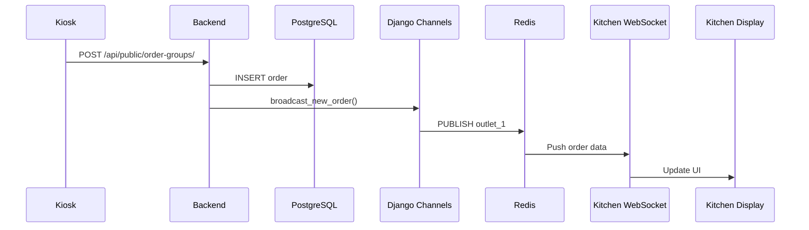
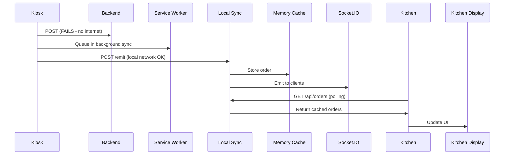

# Testing Guide - Offline-First Architecture

## Overview

Panduan lengkap testing untuk semua komponen dalam offline-first architecture: Master Data Service, Socket Service dengan Polling, Local Sync Server, Django Channels WebSocket, dan Service Worker.

## Testing Environment Setup

### Prerequisites

```bash
# 1. Backend running
docker compose up -d backend redis db

# 2. Local Sync Server running
cd local-sync-server
npm run dev

# 3. Frontend running
cd frontend
npm run dev
```

### Test Tools Required

| Tool | Purpose | Installation |
|------|---------|--------------|
| **Postman/Thunder Client** | API testing | VS Code extension |
| **wscat** | WebSocket testing | `npm install -g wscat` |
| **Browser DevTools** | Frontend debugging | Built-in |
| **Redis CLI** | Redis inspection | `docker exec -it redis redis-cli` |
| **PostgreSQL Client** | Database inspection | `docker exec -it postgres psql -U kioskuser kiosk` |

---

## Phase 1: Component Unit Testing

### 1.1 Local Sync Server Testing

#### Test 1: Health Check
```bash
# Test health endpoint
curl http://localhost:3001/health

# Expected response:
{
  "status": "healthy",
  "timestamp": "2026-01-11T10:00:00.000Z",
  "uptime": 123.456
}
```

**✅ Pass Criteria:** Returns 200 OK with health status

#### Test 2: Socket.IO Connection
```bash
# Test WebSocket connection
wscat -c ws://localhost:3001

# After connected, send:
{"event": "ping"}

# Expected response:
{"event": "pong"}
```

**✅ Pass Criteria:** Connection established, ping/pong works

#### Test 3: Emit Order (Store in Cache)
```bash
# Send order to local server
curl -X POST http://localhost:3001/emit \
  -H "Content-Type: application/json" \
  -d '{
    "event": "new_order",
    "data": {
      "id": 101,
      "order_number": "TEST-001",
      "outlet_id": 1,
      "status": "pending",
      "items": [{"name": "Nasi Goreng", "qty": 2, "price": 25000}],
      "total_amount": "50000"
    }
  }'

# Expected response:
{
  "success": true,
  "message": "Event emitted successfully"
}
```

**✅ Pass Criteria:** Order stored in memory cache, emitted via Socket.IO

#### Test 4: Polling Endpoint (Get Orders)
```bash
# Get all orders for outlet 1
curl "http://localhost:3001/api/orders?outlet_id=1"

# Expected response: Array of orders
[
  {
    "id": 101,
    "order_number": "TEST-001",
    "outlet_id": 1,
    "status": "pending",
    "items": [...],
    "total_amount": "50000",
    "timestamp": "2026-01-11T10:00:00.000Z"
  }
]
```

**✅ Pass Criteria:** Returns stored orders for outlet

#### Test 5: Incremental Polling (since_id)
```bash
# Send 3 orders with IDs 101, 102, 103
for i in {101..103}; do
  curl -X POST http://localhost:3001/emit \
    -H "Content-Type: application/json" \
    -d "{\"event\":\"new_order\",\"data\":{\"id\":$i,\"order_number\":\"ORD-$i\",\"outlet_id\":1,\"status\":\"pending\",\"items\":[],\"total_amount\":\"50000\"}}"
done

# Get only orders since ID 101
curl "http://localhost:3001/api/orders?outlet_id=1&since_id=101"

# Expected: Returns only orders 102 and 103
```

**✅ Pass Criteria:** Returns only orders with ID > since_id

#### Test 6: Multi-Outlet Isolation
```bash
# Send order to outlet 1
curl -X POST http://localhost:3001/emit \
  -H "Content-Type: application/json" \
  -d '{"event":"new_order","data":{"id":201,"outlet_id":1,"order_number":"OUT1-001"}}'

# Send order to outlet 2
curl -X POST http://localhost:3001/emit \
  -H "Content-Type: application/json" \
  -d '{"event":"new_order","data":{"id":202,"outlet_id":2,"order_number":"OUT2-001"}}'

# Get outlet 1 orders (should not include outlet 2)
curl "http://localhost:3001/api/orders?outlet_id=1"

# Get outlet 2 orders (should not include outlet 1)
curl "http://localhost:3001/api/orders?outlet_id=2"
```

**✅ Pass Criteria:** Each outlet sees only their own orders

#### Test 7: Cache Capacity (100 orders limit)
```bash
# Send 150 orders to outlet 1
for i in {1..150}; do
  curl -X POST http://localhost:3001/emit \
    -H "Content-Type: application/json" \
    -d "{\"event\":\"new_order\",\"data\":{\"id\":$i,\"outlet_id\":1,\"order_number\":\"LOAD-$i\"}}"
done

# Get all orders
curl "http://localhost:3001/api/orders?outlet_id=1" | jq 'length'

# Expected: Should return 100 (not 150)
```

**✅ Pass Criteria:** Cache maintains max 100 orders per outlet (FIFO)

---

### 1.2 Django Channels WebSocket Testing

#### Test 1: WebSocket Connection
```bash
# Connect to WebSocket (outlet 1)
wscat -c "ws://localhost:8000/ws/outlet/1/"

# Expected:
Connected (press CTRL+C to quit)
```

**✅ Pass Criteria:** Connection accepted

#### Test 2: Ping/Pong
```bash
# After connected, send:
{"type": "ping", "timestamp": 1704967200000}

# Expected response:
{"type": "pong", "timestamp": 1704967200000}
```

**✅ Pass Criteria:** Pong received with same timestamp

#### Test 3: Join Outlet Group
```bash
# Connect to outlet 2
wscat -c "ws://localhost:8000/ws/outlet/2/"

# Connection should join outlet_2 group
# Check Django logs for:
# ✅ WebSocket connected: outlet 2
```

**✅ Pass Criteria:** Consumer logs connection to correct outlet group

#### Test 4: Broadcast Test via Django Shell
```bash
# Open Django shell
docker exec -it backend python manage.py shell

# Run broadcast test:
from apps.realtime.utils import broadcast_new_order

order_data = {
    'id': 301,
    'order_number': 'WS-TEST-001',
    'outlet_id': 1,
    'status': 'pending',
    'items': [{'name': 'Test Item', 'qty': 1}],
    'total_amount': '25000'
}

broadcast_new_order(order_data)
```

**Connected WebSocket (outlet 1) should receive:**
```json
{
  "event": "new_order",
  "data": {
    "id": 301,
    "order_number": "WS-TEST-001",
    "outlet_id": 1,
    "status": "pending",
    "items": [{"name": "Test Item", "qty": 1}],
    "total_amount": "25000"
  }
}
```

**✅ Pass Criteria:** Message received in real-time

#### Test 5: Redis Channel Layer
```bash
# Check Redis is running
docker exec -it redis redis-cli ping
# Expected: PONG

# Monitor Redis keys
docker exec -it redis redis-cli MONITOR

# In another terminal, broadcast a message
# Redis should show channel operations like:
# "PUBLISH" "asgi:group:outlet_1" "..."
```

**✅ Pass Criteria:** Redis receives and distributes messages

#### Test 6: Multi-Client Broadcast
```bash
# Open 3 terminals, connect to same outlet:
# Terminal 1:
wscat -c "ws://localhost:8000/ws/outlet/1/"

# Terminal 2:
wscat -c "ws://localhost:8000/ws/outlet/1/"

# Terminal 3:
wscat -c "ws://localhost:8000/ws/outlet/1/"

# Broadcast from Django shell (see Test 4)
# All 3 terminals should receive the same message simultaneously
```

**✅ Pass Criteria:** All clients receive broadcast

---

### 1.3 Master Data Service Testing

#### Test 1: IndexedDB Database Creation
```javascript
// Browser console (http://localhost:5173)
const db = await indexedDB.open('kiosk_master_data', 1);
console.log('Database:', db.name, 'Version:', db.version);

// Check object stores
const stores = Array.from(db.objectStoreNames);
console.log('Stores:', stores);
// Expected: ['products', 'categories', 'promotions', 'metadata']
```

**✅ Pass Criteria:** Database created with 4 object stores

#### Test 2: Pre-fetch Master Data
```javascript
// Browser console
import { masterDataService } from '/src/lib/services/masterDataService';

// Trigger pre-fetch
const result = await masterDataService.preFetchData();
console.log('Pre-fetch result:', result);

// Check status
masterDataService.status.subscribe(s => console.log('Status:', s));
// Expected: { syncing: false, error: null, lastSync: Date }

// Check version
masterDataService.version.subscribe(v => console.log('Version:', v));
// Expected: { productsVersion: 1, categoriesVersion: 1, ... }
```

**✅ Pass Criteria:** Data fetched and stored in IndexedDB

#### Test 3: Verify IndexedDB Contents
```javascript
// Browser DevTools → Application → IndexedDB → kiosk_master_data

// Or via console:
const db = await indexedDB.open('kiosk_master_data', 1);
const tx = db.transaction(['products'], 'readonly');
const store = tx.objectStore('products');
const products = await store.getAll();
console.log('Total products:', products.length);
console.log('Sample:', products[0]);
```

**✅ Pass Criteria:** Products stored with correct schema

#### Test 4: Incremental Update (Versioning)
```bash
# 1. Initial sync
# Check current version in browser console:
masterDataService.version.subscribe(v => console.log('Version:', v));
// Note: productsVersion = 1

# 2. Update product in Django admin
# Change price or name of any product

# 3. Trigger sync again
await masterDataService.preFetchData();

# 4. Verify version incremented
masterDataService.version.subscribe(v => console.log('Version:', v));
// Expected: productsVersion = 2
```

**✅ Pass Criteria:** Only changed data fetched, version incremented

#### Test 5: Offline Access
```bash
# 1. Load app while online (data cached)
# 2. Stop backend: docker compose stop backend
# 3. Refresh page
# 4. Check data access:

const products = await masterDataService.getProducts();
console.log('Products (offline):', products.length);
// Expected: Returns cached data
```

**✅ Pass Criteria:** Data accessible without backend

#### Test 6: Cache Expiry Warning
```javascript
// Manually set old lastSync timestamp
const db = await indexedDB.open('kiosk_master_data', 1);
const tx = db.transaction(['metadata'], 'readwrite');
const store = tx.objectStore('metadata');

const oldDate = new Date();
oldDate.setDate(oldDate.getDate() - 2); // 2 days ago

await store.put({ key: 'last_sync', value: oldDate.toISOString() });

// Reload app - should show warning about outdated data
```

**✅ Pass Criteria:** Warning shown for data > 24 hours old

---

### 1.4 Service Worker Testing

#### Test 1: Registration
```javascript
// Browser console (http://localhost:5173)
const registration = await navigator.serviceWorker.getRegistration();
console.log('SW Registered:', !!registration);
console.log('SW Active:', !!registration?.active);
console.log('SW URL:', registration?.active?.scriptURL);
```

**✅ Pass Criteria:** Service Worker registered and active

#### Test 2: Cache Storage
```javascript
// Browser DevTools → Application → Cache Storage
// Should see:
// - workbox-precache-v2-... (build assets)
// - api-cache (API responses)
// - master-data-cache (products, categories)
// - static-cache (images, fonts)

// Or via console:
const cacheNames = await caches.keys();
console.log('Caches:', cacheNames);
```

**✅ Pass Criteria:** Multiple caches created

#### Test 3: Background Sync Registration
```javascript
// Check if sync is registered
const registration = await navigator.serviceWorker.ready;
const tags = await registration.sync.getTags();
console.log('Sync tags:', tags);
// May include 'order-sync-queue' if there are pending orders
```

**✅ Pass Criteria:** Sync API available

#### Test 4: Offline Asset Loading
```bash
# 1. Load app normally
# 2. Open DevTools → Network → Enable "Offline" checkbox
# 3. Refresh page
# 4. App should load from cache (no network requests to origin)
```

**✅ Pass Criteria:** App loads completely offline

#### Test 5: API Cache Strategy (NetworkFirst)
```javascript
// 1. Make API request while online
fetch('/api/products/').then(r => r.json()).then(console.log);

// 2. Check Network tab - should see request to server
// 3. Check Cache Storage - response should be cached
// 4. Go offline (DevTools → Network → Offline)
// 5. Make same request again
fetch('/api/products/').then(r => r.json()).then(console.log);

// 6. Should return cached response (not fail)
```

**✅ Pass Criteria:** NetworkFirst strategy working

#### Test 6: Background Sync (Failed Order)
```javascript
// 1. Go offline (DevTools → Network → Offline)
// 2. Submit order from kiosk
await fetch('/api/public/order-groups/', {
  method: 'POST',
  headers: { 'Content-Type': 'application/json' },
  body: JSON.stringify({
    outlet: 1,
    items: [{ product: 1, quantity: 2 }]
  })
});

// 3. Check background sync
const registration = await navigator.serviceWorker.ready;
const tags = await registration.sync.getTags();
console.log('Pending syncs:', tags);
// Expected: ['order-sync-queue']

// 4. Go back online
// 5. Check DevTools → Network - should see retry POST request
// 6. Check sync tags again - should be empty after successful sync
```

**✅ Pass Criteria:** Failed request queued and retried when online

#### Test 7: Manual Sync
```javascript
// Trigger manual sync via serviceWorkerManager
import { serviceWorkerManager } from '/src/lib/services/serviceWorkerManager';

const success = await serviceWorkerManager.syncNow();
console.log('Manual sync success:', success);

// Check console for sync logs
```

**✅ Pass Criteria:** Manual sync completes successfully

---

### 1.5 Socket Service Testing (Frontend)

#### Test 1: Connection Status
```javascript
// Browser console
import { socketService } from '/src/lib/services/socketService';

// Subscribe to status
socketService.status.subscribe(s => {
  console.log('Mode:', s.mode);
  console.log('Central:', s.centralConnected);
  console.log('Local:', s.localConnected);
  console.log('Polling:', s.isPolling);
});

// Expected initial state:
// Mode: 'disconnected', all false
```

**✅ Pass Criteria:** Status store reactive and accurate

#### Test 2: Connect to Backend WebSocket
```javascript
// Connect to Django Channels
socketService.connectCentral();

// Wait 2 seconds, check status
// Expected: mode = 'connected', centralConnected = true
```

**✅ Pass Criteria:** WebSocket connection established

#### Test 3: Connect to Local Sync Server
```javascript
// Connect to local server
socketService.connectLocal();

// Wait 2 seconds, check status
// Expected: mode = 'connected', localConnected = true
```

**✅ Pass Criteria:** Socket.IO connection established

#### Test 4: Receive Events
```javascript
// Listen for new orders
socketService.on('new_order', (data) => {
  console.log('📦 New order received:', data);
});

// Trigger event from another source:
// - Create order in kiosk (if online → Django Channels)
// - Emit from local server (if offline → Socket.IO)
```

**✅ Pass Criteria:** Events received and handled

#### Test 5: Polling Fallback
```javascript
// 1. Stop both WebSocket servers:
//    - docker compose stop backend
//    - Stop local-sync-server

// 2. Try to connect
socketService.connectLocal();

// 3. After connection fails, start polling
setTimeout(() => {
  if (!socketService.isConnected()) {
    socketService.startPolling(1); // outlet_id = 1
  }
}, 5000);

// 4. Restart local-sync-server
// 5. Check if polling works:
socketService.status.subscribe(s => {
  console.log('Polling active:', s.isPolling);
});

// Polling should fetch orders every 3 seconds
```

**✅ Pass Criteria:** Polling activates when WebSocket fails

#### Test 6: Event Deduplication
```javascript
// Send same order twice via local server
for (let i = 0; i < 2; i++) {
  await fetch('http://localhost:3001/emit', {
    method: 'POST',
    headers: { 'Content-Type': 'application/json' },
    body: JSON.stringify({
      event: 'new_order',
      data: { id: 999, order_number: 'DUP-001', outlet_id: 1 }
    })
  });
}

// Listen for events
let receivedCount = 0;
socketService.on('new_order', (data) => {
  if (data.id === 999) receivedCount++;
  console.log('Received count:', receivedCount);
});

// Expected: receivedCount should be 1 (deduplicated by ID)
```

**✅ Pass Criteria:** Duplicate events filtered

---

## Phase 2: Integration Testing

### 2.1 End-to-End Order Flow (Online Mode)



**Test Steps:**
1. Open Kiosk in browser (http://localhost:5173)
2. Open Kitchen Display in another tab/window
3. Create order in Kiosk
4. Verify order appears in Kitchen Display within 1 second

**✅ Pass Criteria:** Order visible in kitchen < 1 second

### 2.2 End-to-End Order Flow (Offline Mode)



**Test Steps:**
1. Stop backend: `docker compose stop backend`
2. Start local-sync-server (should already be running)
3. Open Kiosk (offline mode should activate)
4. Open Kitchen Display
5. Create order in Kiosk
6. Verify Kitchen Display receives via polling

**✅ Pass Criteria:** Order visible in kitchen via local sync

### 2.3 Offline to Online Transition

**Test Steps:**
1. Start with backend offline
2. Create 3 orders in Kiosk (queued in Service Worker)
3. Verify orders in local-sync-server: `curl http://localhost:3001/api/orders?outlet_id=1`
4. Start backend: `docker compose start backend`
5. Wait for Service Worker background sync to retry
6. Verify orders in PostgreSQL:
```bash
docker exec -it postgres psql -U kioskuser kiosk -c "SELECT id, order_number, status FROM orders_ordergroup ORDER BY created_at DESC LIMIT 5;"
```

**✅ Pass Criteria:** All queued orders synced to backend

### 2.4 Master Data Sync Flow

**Test Steps:**
1. Clear IndexedDB (DevTools → Application → Clear storage)
2. Reload app while online
3. Check console for "🔄 Pre-fetching master data..."
4. Verify IndexedDB populated: DevTools → Application → IndexedDB
5. Update product price in Django Admin
6. Reload app
7. Verify only incremental update fetched (check Network tab)

**✅ Pass Criteria:** Incremental updates working correctly

---

## Phase 3: Performance Testing

### 3.1 WebSocket Latency Test

**Test Script (Node.js):**
```javascript
// test-ws-latency.js
const WebSocket = require('ws');

const ws = new WebSocket('ws://localhost:8000/ws/outlet/1/');
const latencies = [];

ws.on('open', () => {
  for (let i = 0; i < 100; i++) {
    const startTime = Date.now();
    ws.send(JSON.stringify({ type: 'ping', timestamp: startTime }));
    
    ws.once('message', (data) => {
      const endTime = Date.now();
      const latency = endTime - startTime;
      latencies.push(latency);
      
      if (latencies.length === 100) {
        const avg = latencies.reduce((a, b) => a + b) / 100;
        const max = Math.max(...latencies);
        const min = Math.min(...latencies);
        console.log(`Avg: ${avg}ms, Min: ${min}ms, Max: ${max}ms`);
        ws.close();
      }
    });
  }
});
```

**Run:**
```bash
node test-ws-latency.js
```

**✅ Pass Criteria:** Average latency < 100ms

### 3.2 Polling Performance Test

```bash
# Test polling endpoint performance
ab -n 1000 -c 10 "http://localhost:3001/api/orders?outlet_id=1"

# Expected results:
# Requests per second: > 500
# Average response time: < 20ms
# No failed requests
```

**✅ Pass Criteria:** 
- RPS > 500
- Avg response < 20ms
- 0% failure rate

### 3.3 IndexedDB Write Performance

```javascript
// test-indexeddb-performance.js
async function testWritePerformance() {
  const products = Array.from({ length: 10000 }, (_, i) => ({
    id: i,
    name: `Product ${i}`,
    price: Math.random() * 100000,
    category_id: Math.floor(Math.random() * 20)
  }));
  
  const db = await indexedDB.open('test_db', 1);
  
  const startWrite = performance.now();
  const tx = db.transaction(['products'], 'readwrite');
  const store = tx.objectStore('products');
  
  for (const product of products) {
    store.put(product);
  }
  
  await tx.complete;
  const writeTime = performance.now() - startWrite;
  console.log(`Write 10k products: ${writeTime.toFixed(2)}ms`);
  
  const startRead = performance.now();
  const txRead = db.transaction(['products'], 'readonly');
  const storeRead = txRead.objectStore('products');
  const allProducts = await storeRead.getAll();
  const readTime = performance.now() - startRead;
  console.log(`Read 10k products: ${readTime.toFixed(2)}ms`);
}
```

**✅ Pass Criteria:**
- Write 10k products: < 1000ms
- Read 10k products: < 100ms

### 3.4 Service Worker Cache Size

```javascript
// Check total cache size
async function getCacheSize() {
  if ('storage' in navigator && 'estimate' in navigator.storage) {
    const estimate = await navigator.storage.estimate();
    const usage = estimate.usage / 1024 / 1024; // MB
    const quota = estimate.quota / 1024 / 1024; // MB
    console.log(`Cache usage: ${usage.toFixed(2)} MB / ${quota.toFixed(2)} MB`);
    console.log(`Percentage: ${(usage / quota * 100).toFixed(2)}%`);
  }
}

getCacheSize();
```

**✅ Pass Criteria:** Cache usage < 50 MB for typical dataset

---

## Phase 4: Load Testing

### 4.1 Concurrent WebSocket Connections

```bash
# Install hey (HTTP load generator)
go install github.com/rakyll/hey@latest

# Test 100 concurrent WebSocket connections
for i in {1..100}; do
  wscat -c "ws://localhost:8000/ws/outlet/1/" &
done

# Monitor backend resources:
docker stats backend
```

**✅ Pass Criteria:**
- All 100 connections established
- Backend CPU < 80%
- Backend Memory < 2GB

### 4.2 Polling Load Test

```bash
# Test 1000 requests, 50 concurrent
ab -n 1000 -c 50 "http://localhost:3001/api/orders?outlet_id=1"
```

**✅ Pass Criteria:**
- 0% failed requests
- Mean response time < 50ms
- Memory usage < 500MB

### 4.3 Redis Channel Layer Load

```bash
# Send 1000 broadcasts rapidly
for i in {1..1000}; do
  docker exec -it backend python manage.py shell <<EOF
from apps.realtime.utils import broadcast_new_order
broadcast_new_order({'id': $i, 'outlet_id': 1, 'order_number': 'LOAD-$i'})
EOF
done

# Monitor Redis
docker exec -it redis redis-cli INFO stats
```

**✅ Pass Criteria:**
- Redis CPU < 50%
- All messages delivered
- No connection drops

### 4.4 Service Worker Background Sync Queue

```javascript
// Simulate 100 failed orders
async function testSyncQueue() {
  // Go offline
  await new Promise(resolve => {
    console.log('Set DevTools to offline, then press Enter');
    process.stdin.once('data', resolve);
  });
  
  // Queue 100 orders
  for (let i = 0; i < 100; i++) {
    await fetch('/api/public/order-groups/', {
      method: 'POST',
      headers: { 'Content-Type': 'application/json' },
      body: JSON.stringify({
        outlet: 1,
        items: [{ product: 1, quantity: 1 }]
      })
    }).catch(() => {}); // Expected to fail offline
  }
  
  console.log('100 orders queued. Go online and wait...');
  
  // Monitor sync completion
  const registration = await navigator.serviceWorker.ready;
  setInterval(async () => {
    const tags = await registration.sync.getTags();
    console.log('Pending syncs:', tags.length);
  }, 1000);
}
```

**✅ Pass Criteria:**
- All 100 orders queued
- All synced within 5 minutes when online
- No data loss

---

## Phase 5: Offline Scenarios Testing

### 5.1 Complete Internet Outage

**Scenario:** Internet down, local network OK

**Steps:**
1. Stop backend: `docker compose stop backend`
2. Verify Local Sync Server running
3. Test Kiosk → Local Sync Server communication
4. Test Kitchen Display polling
5. Create 5 orders in Kiosk
6. Verify all orders visible in Kitchen

**✅ Pass Criteria:** Full functionality with local network only

### 5.2 Local Network Outage

**Scenario:** Local network down, internet OK

**Steps:**
1. Stop Local Sync Server
2. Keep backend running
3. Test Kiosk → Backend communication (online mode)
4. Create orders in Kiosk
5. Verify orders in backend database
6. Kitchen Display should use backend WebSocket (not local)

**✅ Pass Criteria:** System falls back to internet-based sync

### 5.3 Partial Connectivity (Intermittent)

**Scenario:** Connection drops randomly

**Steps:**
1. Use DevTools Network throttling: "Fast 3G" or "Slow 3G"
2. Create orders while connection is unreliable
3. Verify Service Worker queues failed requests
4. Check automatic retry when connection stabilizes

**✅ Pass Criteria:** No lost orders despite intermittent connectivity

### 5.4 Extended Offline Period (24+ hours)

**Steps:**
1. Cache master data while online
2. Go offline for 24+ hours (simulate by setting date forward)
3. App should show warning: "Data may be outdated"
4. App should still function with cached data
5. When online, trigger sync

**✅ Pass Criteria:** App usable with warning, syncs when available

### 5.5 Browser Restart While Offline

**Steps:**
1. Go offline
2. Create 3 orders (queued in Service Worker)
3. Close browser completely
4. Reopen browser (still offline)
5. Check Service Worker sync queue persists
6. Go online
7. Verify queued orders sync

**✅ Pass Criteria:** Queued orders survive browser restart

---

## Phase 6: Security Testing

### 6.1 WebSocket Authentication

**Test unauthorized access:**
```bash
# Try to connect without token
wscat -c "ws://localhost:8000/ws/outlet/1/"

# Expected: Connection refused or closed immediately
```

**Test with valid token:**
```bash
# Get JWT token first
TOKEN=$(curl -X POST http://localhost:8000/api/token/ \
  -H "Content-Type: application/json" \
  -d '{"username":"admin","password":"admin"}' | jq -r '.access')

# Connect with token
wscat -c "ws://localhost:8000/ws/outlet/1/?token=$TOKEN"

# Expected: Connection accepted
```

**✅ Pass Criteria:** Unauthorized connections rejected

### 6.2 CORS Policy

**Test cross-origin requests:**
```bash
# From different origin
curl -X GET http://localhost:8000/api/products/ \
  -H "Origin: https://malicious-site.com" \
  -i

# Expected: CORS error or rejected
```

**✅ Pass Criteria:** Only allowed origins accepted

### 6.3 Rate Limiting (Polling)

**Test rate limit:**
```bash
# Send 100 requests in 1 second
for i in {1..100}; do
  curl "http://localhost:3001/api/orders?outlet_id=1" &
done

# Expected: Some requests return 429 Too Many Requests
```

**✅ Pass Criteria:** Rate limiter blocks excessive requests

### 6.4 SQL Injection (Backend API)

**Test malicious input:**
```bash
curl -X GET "http://localhost:8000/api/products/?id=1' OR '1'='1"
```

**✅ Pass Criteria:** Django ORM protects against SQL injection

### 6.5 XSS Prevention (Master Data)

**Test script injection:**
```bash
# Create product with malicious name
curl -X POST http://localhost:8000/api/products/ \
  -H "Authorization: Bearer $TOKEN" \
  -H "Content-Type: application/json" \
  -d '{"name":"<script>alert(\"XSS\")</script>","price":10000}'

# Load product in Kiosk
# Expected: Script not executed, rendered as text
```

**✅ Pass Criteria:** All user input properly escaped

---

## Phase 7: Failure Recovery Testing

### 7.1 Redis Failure

**Steps:**
1. Stop Redis: `docker compose stop redis`
2. Try to broadcast order via Django Channels
3. Expected: Error logged, but app continues
4. Restart Redis: `docker compose start redis`
5. Verify reconnection

**✅ Pass Criteria:** Graceful degradation, auto-recovery

### 7.2 PostgreSQL Failure

**Steps:**
1. Stop database: `docker compose stop db`
2. Try to create order via API
3. Expected: 500 error returned, Service Worker queues request
4. Restart database: `docker compose start db`
5. Verify queued request syncs

**✅ Pass Criteria:** Failed requests queued and retried

### 7.3 IndexedDB Quota Exceeded

**Steps:**
```javascript
// Fill IndexedDB to quota
async function fillIndexedDB() {
  const db = await indexedDB.open('test_quota', 1);
  const tx = db.transaction(['data'], 'readwrite');
  const store = tx.objectStore('data');
  
  try {
    while (true) {
      const largeData = new Array(1000000).fill('x').join('');
      await store.put({ id: Date.now(), data: largeData });
    }
  } catch (error) {
    console.log('Quota exceeded:', error);
    // App should handle gracefully
  }
}
```

**✅ Pass Criteria:** Error handled, user notified, app continues

### 7.4 Service Worker Update

**Steps:**
1. Make change to service-worker.js
2. Rebuild frontend
3. Load app (old SW still active)
4. Trigger skipWaiting from serviceWorkerManager
5. Verify new SW activates
6. Check caches cleared/updated

**✅ Pass Criteria:** Smooth SW update without data loss

---

## Test Result Template

### Test Report Format

```markdown
# Test Report - [Date]

## Environment
- Backend: Docker (commit: abc123)
- Frontend: localhost:5173 (commit: def456)
- Local Sync: v1.0.0
- Browser: Chrome 120.0.6099

## Test Results

| Phase | Test | Status | Notes |
|-------|------|--------|-------|
| 1.1 | Health Check | ✅ PASS | Response time: 5ms |
| 1.1 | Socket.IO Connection | ✅ PASS | Connected in 120ms |
| 1.1 | Emit Order | ✅ PASS | Stored successfully |
| 1.1 | Polling Endpoint | ✅ PASS | Returned 3 orders |
| ... | ... | ... | ... |

## Performance Metrics
- WebSocket latency: avg 45ms, max 89ms
- Polling RPS: 678 req/s
- IndexedDB write: 750ms for 10k items
- Cache size: 12.5 MB

## Issues Found
1. **Minor**: Polling interval inconsistent under heavy load
   - Severity: Low
   - Status: Investigating
   
2. **Critical**: None

## Recommendations
- Consider implementing adaptive polling
- Monitor Redis memory usage in production
- Add IndexedDB quota monitoring

## Sign-off
- Tested by: [Name]
- Date: 2026-01-11
- Status: READY FOR PRODUCTION ✅
```

---

## Automated Testing Scripts

### Full Test Suite Runner

```bash
#!/bin/bash
# run-all-tests.sh

echo "=== Starting Full Test Suite ==="

# 1. Backend health
echo "Testing backend..."
curl -f http://localhost:8000/health || exit 1

# 2. Local Sync Server
echo "Testing local sync server..."
curl -f http://localhost:3001/health || exit 1

# 3. WebSocket connection
echo "Testing WebSocket..."
timeout 5 wscat -c "ws://localhost:8000/ws/outlet/1/" -x '{"type":"ping"}' || exit 1

# 4. Create test order
echo "Creating test order..."
curl -X POST http://localhost:3001/emit \
  -H "Content-Type: application/json" \
  -d '{"event":"new_order","data":{"id":999,"outlet_id":1}}' || exit 1

# 5. Verify polling
echo "Testing polling..."
ORDERS=$(curl -s "http://localhost:3001/api/orders?outlet_id=1" | jq 'length')
[[ $ORDERS -gt 0 ]] || exit 1

echo "✅ All tests passed!"
```

**Run:**
```bash
chmod +x run-all-tests.sh
./run-all-tests.sh
```

---

## Summary

This comprehensive testing guide covers:
- ✅ Component unit tests (Local Sync, Django Channels, Master Data, Service Worker, Socket Service)
- ✅ Integration tests (End-to-end flows, online/offline transitions)
- ✅ Performance tests (Latency, throughput, cache efficiency)
- ✅ Load tests (Concurrent connections, high-volume operations)
- ✅ Offline scenarios (Internet outage, network issues, extended offline)
- ✅ Security tests (Authentication, CORS, rate limiting, injection prevention)
- ✅ Failure recovery (Redis/DB failures, quota issues, SW updates)

**Total Test Cases:** 50+

**Estimated Testing Time:** 4-6 hours for complete suite

**Recommended Testing Frequency:**
- Unit tests: Every commit
- Integration tests: Daily
- Performance tests: Weekly
- Load tests: Before each release
- Security tests: Monthly
- Offline scenarios: Before each release
